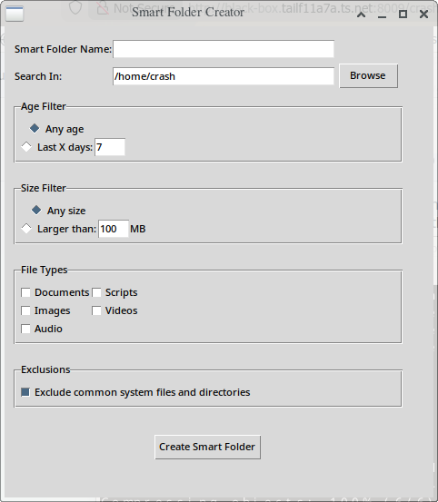

# Folder Flow

Smart folder functionality on Linux independent of distribution or desktop enviromment. Even works in terminal.

GUI to create filters for files by type, age, size, and other attributes. Creates symlinks to these files in another folder. Monitor watches for changes to files included in the search and updates the symlinks in near real time.

## Screenshots

## In Development

To Do:
- Requirments.txt
- Installer to set up monitor as background service.
- Improve filter options

## Features

- Distribution, Desktop Environment and file browser agnostic
- Leverages native Linux characteristics (symlinks, file searches) to generate symlinks in a separate folder
- Background Monitor Service keeps symlinks up to date with file changes

## Supported Filters

- Age 
-- Last X days
- Size 
-- Larger than X MB
- Type
-- Documents, Images, Audio, Video, Scripts
- Optionally exclude common system files and directories
